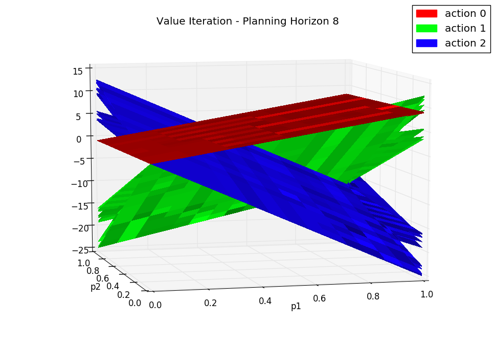
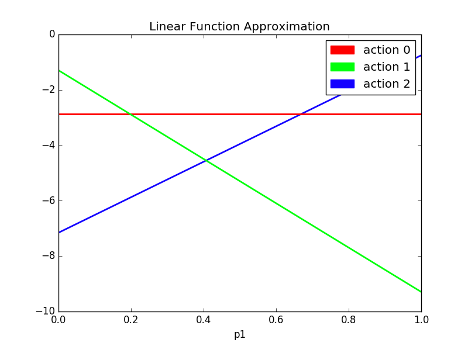

# Experiment Notes

To determine whether it is possible to approximate a value function for a small POMDP, I 
used simple linear function approximation to predict the pruned set of alpha vectors. For the Tiger 
problem, one can visually inspect the value function with a planning horizon of eight, and see that it can be
approximated by three well-placed alpha vectors. Using the one-step rewards for each of the three actions
as a basis function, I computed the three alpha vectors as follows:

<insert MathJax equation here>

where each alpha vector has the same dimension as the belief state space. I initialized all weights to 1.0, so that
the agent essentially started learning from a planning horizon of 1 (greedy action-selection with no planning).

The goal of this learning task is to determine whether the classic value iteration algorithm having exponential
run time complexity can be avoided with function approximation. For baselines, I compared against planning horizons
of one and eight, computed with Lark's pruning algorithm, as well as a random agent. 

## Baseline Results

*Results averaged over 5 experiments with different random seeds*

| planning horizon | epochs/experiment  | mean reward/epoch | std dev reward/epoch | mean wrong door count  |
|---|---|---|---|---|
| 8 | 1000 | 4.703091980822256 | 8.3286422581 | 102.4 |
| 1 | 1000  | 4.45726700400672 | 10.3950449814 | 148.6 |
| random | 1000  | -5.466722724994926  | 14.6177021188  | 503.0 |

The mean wrong door counts represent the number of times the agent opened the door with the tiger.

Here are plots of the alpha vectors returned by the classic value iteration algorithm.
There are 77 alpha vectors in the value function for the planning horizon of 8.




## Linear Function Approximation

The best results so far were obtained with the following parameters: 

```python
{'beta': 0.001,
 'discount': 0.95,
 'env': 'Tiger',
 'epsilon_decay': 0.99,
 'epsilon_decay_step': 75,
 'epsilon_minimum': 0.02,
 'epsilon_start': 0.2,
 'learning_rate': 0.05,
 'learning_rate_decay': 0.996,
 'learning_rate_decay_step': 50,
 'learning_rate_minimum': 0.00025,
 'max_steps': 50,
 'n_epochs': 5000,
 'planning_horizon': 5,
 'save': True,
 'seed': 12157,
 'solver': 'LinearAlphaNet',
 'test': 5,
 'use_tf': True}
```

After doing a hyperparameter search, the learning rate of `0.05` was chosen with an exponential decay of `0.996` every `50`
steps, until the learning rate is at `0.00025`. The Momentum optimizer is used with a parameter of `0.8`. L2 regularization
with a beta parameter of `0.001` is chosen via a parameter search as well. 

To encourage exploration, e-greedy action-selection is added. This way, early on during training, the agent isn't overly
greedy given that the weights are initialized to `1.0` to simulate a planning horizon of `1`. 

Training is carried out by running for `5000` epochs, where each epoch consisted of `50` agent interactions with the environment.
The agent is evaluated every `5` epochs to test its progress.

### Results

After training, the agent is tested by averaging `5` runs with different random seeds, where each run consists of `1000` epochs.

| epochs/experiment  | mean reward/epoch | std dev reward/epoch | mean wrong door count  |
|---|---|---|---|
| 1000 | 4.286225210218933 | 10.0488961427 | 145.8 |


This figure depicts the alpha vectors as computed after training the linear function approximator. 

There is not a statistically significant improvement over the performance of a planning horizon of `1`. 
Some reasons for this are:

1. The objective function is minimizing the MSE of the predicted value function for a given belief and the 
predicted value function for the transformed belief given the current action and observation. This objective function 
doesn't encourage the agent to do things like explore actions that are more informative than others. In fact, the agent is
quite happy to find some nearby local minima that allows its value function to be "self-consistent", i.e., it looks like
the agent has converged onto the optimal value function, but in fact it has found a biased solution. This is a common problem
found with objective functions modeled after Temporal Difference Learning.

2. This learning approach is highly sensitive to the number of alpha vectors and their initialization. In this case,
I can visually inspect the value function with a planning horizon of `8` and see that `3` vectors suffice. Hence, I am satisfied
to initialize my `3` approximate alpha-vectors to be the immediate rewards gleaned from the `3` actions.

One suggested improvement is adding an auxiliary task to the agent's loss function that seeks to maximize its information gain about 
 the effects of its actions on the environment.